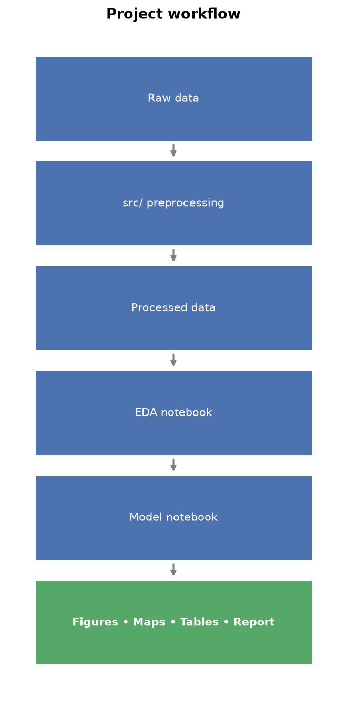

# Wildfire Insured-Loss Modelling

Frequency-severity wildfire loss model for an Alberta insurance portfolio,
combining climate-derived Fire Weather Index (FWI) and geospatial fuel-type
data as hazard drivers. Evaluated using leave-one-event-out validation, tested
for spatial dependence between FSAs, and applied illustratively under a future
SSP1-2.6 climate scenario.

**Start here:** [`reports/wildfire_loss_report.md`](reports/wildfire_loss_report.md)
is the full write-up (data pipeline, EDA, model development, validation,
future projection, discussion).

## Project workflow



Raw data flows through the numbered `src/` preprocessing scripts into processed datasets, which feed the EDA notebook and then the model-fitting notebook; all figures, maps, tables, and the report are downstream outputs of that chain.

## Project structure

```
wildfire-insured-loss-model/
├── data/
│   ├── raw/                  provided + sourced input data (not modified)
│   ├── processed/            derived/merged datasets used by later steps
│   └── data_dictionary.csv
├── docs/
│   └── data_dictionary.md    dataset-level documentation
├── notebooks/                 numbered in run order
│   ├── 01_exploration_and_features.ipynb   EDA
│   └── 02_model_fitting.ipynb              model development, validation,
│                                            spatial dependence, future projection
├── src/                       preprocessing scripts, numbered in run order
│   ├── __init__.py               makes `src` importable for tests only
│   ├── common.py                 shared paths/config/validation (not a pipeline step)
│   ├── 01_fetch_climate_data.py
│   ├── 02_compute_fwi.py
│   ├── 03_extract_fsa_boundaries.py
│   ├── 04_process_fuel_raster.py
│   ├── 05_aggregate_climate_to_fsa.py
│   ├── 06_build_static_fsa_features.py
│   └── 07_build_claims_feature_table.py
├── tests/                     pytest suite for the riskiest src/common.py logic
│   ├── test_common.py
│   ├── test_fwi_inputs.py
│   ├── test_spatial_aggregation.py
│   └── test_feature_table.py
├── outputs/
│   ├── figures/               chart PNGs referenced by the report/notebooks
│   ├── maps/                  choropleth PNGs
│   └── tables/                exported tables (coefficient_table.csv, model_comparison.csv)
├── reports/
│   └── wildfire_loss_report.md   final written report (the main deliverable)
├── presentation/               final slide deck
└── references/                 external sources list + AI usage disclosure
```

`src/` scripts are numbered so the pipeline order is obvious — each is a
standalone, runnable step that only imports shared config from `common.py`,
never from each other (Python identifiers can't start with a digit, so
`01_foo.py` can't be `import`ed by another script anyway).

## Setup

Requires Python 3.11 specifically (see note below).

```bash
python3.11 -m venv .venv
source .venv/bin/activate
pip install -r requirements.txt
```

Or with conda:

```bash
conda env create -f environment.yml
conda activate wildfire-loss-model
```

**Why Python 3.11, not the latest:** `llvmlite`/`numba` (a dependency of
`xclim`'s fire-index calculation) publish no macOS x86_64 (Intel) wheels
past `llvmlite==0.41.1` / `numba==0.58.1` -- newer versions are source-only
and need a full LLVM/CMake toolchain to build. `requirements.txt` and
`environment.yml` both pin to these versions. If you're on Apple Silicon or
Linux, you may not need this pin -- try the latest versions first.

## Data Acquisition

Some source datasets are excluded from this repository because of their size.

Download the following datasets before running the preprocessing pipeline:

- Canadian FSA boundaries (Statistics Canada)
- Canadian FBP fuel raster
- NASA NEX-GDDP CMIP6 climate data (downloaded automatically)

See `references/external_sources.md` for source URLs and licensing information.

## Running the pipeline

Run the numbered scripts in order, from the project root:

```bash
python src/01_fetch_climate_data.py
python src/02_compute_fwi.py
python src/03_extract_fsa_boundaries.py
python src/04_process_fuel_raster.py
python src/05_aggregate_climate_to_fsa.py
python src/06_build_static_fsa_features.py
python src/07_build_claims_feature_table.py
```

- **`01_fetch_climate_data.py`** -- fetches NEX-GDDP-CMIP6 climate data
  (`tas`, `hurs`, `pr`, `sfcWind`) for the configured bounding box (Alberta
  by default -- see `src/common.py`). Parametrized by year range, so the
  same function also fetches the future (2045-2050) horizon used for the
  climate-scenario projection. Per-variable-year fetches are cached under
  `data/raw/climate_data/_cache/` -- an interrupted run can be re-launched
  and will skip already-fetched combinations. Output lands in
  `data/processed/climate/`.
- **`02_compute_fwi.py`** -- computes daily FWI components (`DC`, `DMC`,
  `FFMC`, `ISI`, `BUI`, `FWI`) via `xclim` from script 01's output. Expect
  ~60% NaN over a full calendar year at this latitude -- that's the WF93
  fire-season mask working as intended (long winters have no fire season),
  not missing data.
- **`03_extract_fsa_boundaries.py`** -- filters the national FSA boundary
  shapefile to Alberta and cross-checks it against the portfolio data's FSA
  list. Output lands in `data/processed/boundaries/`. 5 portfolio FSAs have
  no matching polygon in this boundary vintage -- see the report Section 4 for the
  breakdown of which are legitimate exclusions vs. real gaps.
- **`04_process_fuel_raster.py`** -- zonal statistics of the FBP Canada fuel
  raster onto FSA polygons (dominant fuel class, class diversity).
- **`05_aggregate_climate_to_fsa.py`** -- area-weighted spatial join of the
  daily FWI grid onto FSA polygons (equal-area projection, NaN-aware).
  Reused unchanged (different input/output paths) to produce the future
  (2045-2050) FSA-level FWI series for the climate-scenario projection.
- **`06_build_static_fsa_features.py`** -- combines fuel + current exposure
  into one row per FSA.
- **`07_build_claims_feature_table.py`** -- parses each claim's event-date
  window, aggregates FWI over that window, and attaches static features.
  Output: `data/processed/features/{region}_claims_features.csv`, the input
  to the modelling notebook.

The pipeline is region-agnostic -- a single config file (`src/common.py`)
controls which region's bounding box, province filter, and future-horizon
year range are used.

## Testing

A small `tests/` suite covers the riskiest pure-function transformations
extracted into `src/common.py` -- longitude conversion, NaN-aware
area-weighted aggregation, climate-input unit/range validation, and the
final feature-table checks (required columns, duplicate keys, non-negative
values). It does not test model fitting, exact coefficients, chart/map
appearance, external downloads, or the pipeline end to end.

```bash
pytest -q
```

## Notebooks

- **`notebooks/01_exploration_and_features.ipynb`** -- EDA: portfolio/claims
  structure, coverage checks, severity vs. exposure, spatial patterns,
  feature distributions.
- **`notebooks/02_model_fitting.ipynb`** -- frequency-severity model
  (Negative Binomial + Gamma GLM combining climate and geospatial
  features), evaluation tables/figures (AIC table, coefficient plot,
  actual-vs-predicted, residuals), leave-one-event-out out-of-sample
  validation (with a MAE/RMSE/convergence summary table), a GEE
  spatial-dependence sensitivity check, and a future (SSP1-2.6,
  2045-2050) loss projection whose outputs are explicitly labelled
  "illustrative" due to a feature-scale mismatch with the training data.
  Kept intentionally lean (headers, code, tables, a few short
  interpretive notes, a closing Key Takeaways cell) -- full narrative,
  interpretation, and limitations are in the report, not duplicated here.

## Data

- `data/raw/provided_portfolio_data.csv` / `provided_claims_data.csv` --
  the provided insurance portfolio and historical claims data (split from
  `data/raw/Sample Wildfire data.xlsx`)
- `data/raw/fuel_data/` -- FBP Canada 30m fuel type raster
- `data/raw/boundary_data/` -- national Canada FSA boundary shapefile;
  `data/processed/boundaries/` -- Alberta subset
- `data/raw/climate_data/` / `data/processed/climate/` -- historical and
  future NEX-GDDP-CMIP6 climate data and derived FWI
- `data/processed/features/` -- static FSA features and the claims feature
  table used for modelling
- `data/data_dictionary.csv` (flat per-field lookup) / `docs/data_dictionary.md`
  (dataset-level: grain, keys, coverage, missing-value semantics) --
  documentation of all of the above, kept in sync with each other

## Status

Data pipeline, EDA, model development, out-of-sample validation, spatial
dependence testing, and the future climate-scenario projection are all
complete. See [`reports/wildfire_loss_report.md`](reports/wildfire_loss_report.md)
for the full write-up, including known limitations and next steps.
