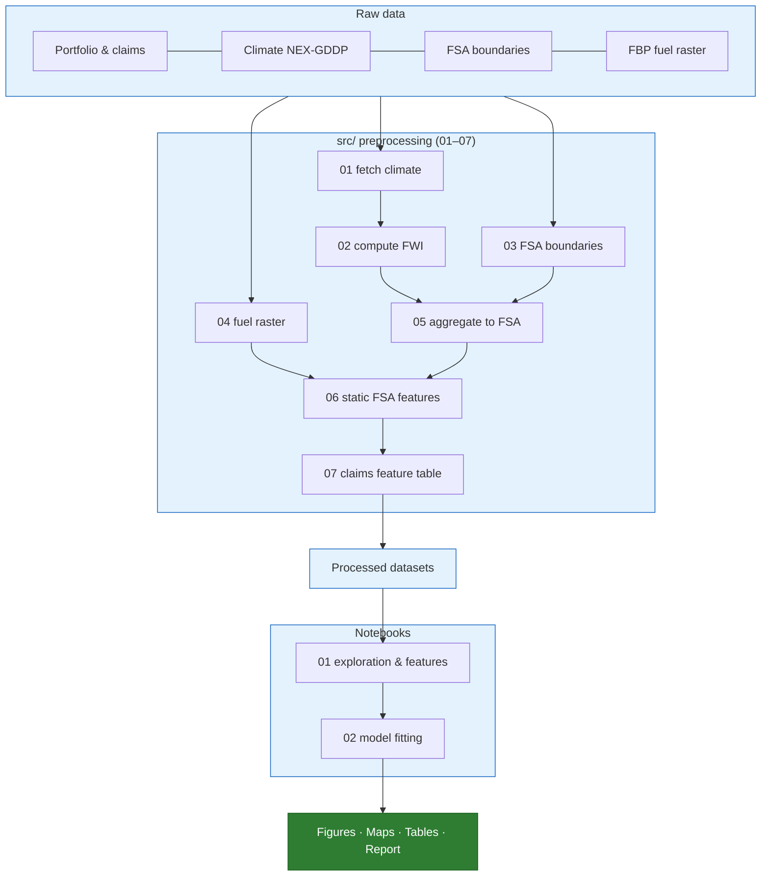

# Wildfire Insured-Loss Modelling

Frequency–severity model of insured wildfire losses for an Alberta insurance
portfolio, combining climate-derived Fire Weather Index (FWI) and geospatial
fuel-type data as hazard drivers. Evaluated using leave-one-event-out validation,
tested for spatial dependence between FSAs, and applied illustratively under a
future SSP1-2.6 climate scenario.

## Highlights

- Reproducible preprocessing pipeline (7 standalone scripts)
- Climate and geospatial feature engineering
- Negative Binomial frequency + Gamma severity modelling
- Leave-one-event-out validation
- Spatial dependence sensitivity analysis (GEE)
- Illustrative SSP1-2.6 climate projection

**Start here:** [`reports/wildfire_loss_report.md`](reports/wildfire_loss_report.md)
is the full write-up (data pipeline, EDA, model development, validation,
future projection, discussion).

## Project workflow



Raw data flows through the numbered `src/` preprocessing scripts into processed datasets, which feed the EDA notebook and then the model-fitting notebook; all figures, maps, tables, and the report are downstream outputs of that chain.

## Project structure

```
wildfire-insured-loss-model/
├── data/
│   ├── raw/                  provided + sourced input data (not modified)
│   ├── processed/            derived/merged datasets used by later steps
│   └── data_dictionary.csv
├── docs/
│   └── data_dictionary.md    dataset-level documentation
├── notebooks/                 numbered in run order
│   ├── 01_exploration_and_features.ipynb   EDA
│   └── 02_model_fitting.ipynb              model development, validation,
│                                            spatial dependence, future projection
├── src/                       preprocessing scripts, numbered in run order
│   ├── __init__.py               package marker
│   ├── common.py                 shared paths/config/validation (not a pipeline step)
│   ├── 01_fetch_climate_data.py
│   ├── 02_compute_fwi.py
│   ├── 03_extract_fsa_boundaries.py
│   ├── 04_process_fuel_raster.py
│   ├── 05_aggregate_climate_to_fsa.py
│   ├── 06_build_static_fsa_features.py
│   └── 07_build_claims_feature_table.py
├── tests/                     pytest suite for the riskiest src/common.py logic
│   ├── test_common.py
│   ├── test_fwi_inputs.py
│   ├── test_spatial_aggregation.py
│   └── test_feature_table.py
├── outputs/
│   ├── figures/               chart PNGs referenced by the report/notebooks
│   ├── maps/                  choropleth PNGs
│   └── tables/                exported analysis tables
├── reports/
│   └── wildfire_loss_report.md   final written report (the main deliverable)
├── presentation/               final slide deck
└── references/                 external sources list + AI usage disclosure
```

Scripts are numbered to indicate execution order and are designed to run
independently.

## Setup

Requires Python 3.11.

```bash
python3.11 -m venv .venv
source .venv/bin/activate
pip install -r requirements.txt
```

Or with conda:

```bash
conda env create -f environment.yml
conda activate wildfire-loss-model
```

## Key libraries

- pandas
- geopandas
- xarray
- xclim
- rasterio
- statsmodels
- scikit-learn
- matplotlib
- pytest

## Data Acquisition

Some source datasets are excluded from this repository because of their size.

Download the following datasets before running the preprocessing pipeline:

- Canadian FSA boundaries (Statistics Canada)
- Canadian FBP fuel raster
- NASA NEX-GDDP CMIP6 climate data
  (downloaded automatically by `01_fetch_climate_data.py`)

See `references/external_sources.md` for source URLs and licensing information.

## Running the pipeline

Run the numbered scripts in order, from the project root:

```bash
python src/01_fetch_climate_data.py          # downloads and caches NEX-GDDP climate data
python src/02_compute_fwi.py                 # computes daily FWI components via xclim
python src/03_extract_fsa_boundaries.py      # filters national FSA boundaries to Alberta
python src/04_process_fuel_raster.py         # zonal statistics of FBP fuel raster onto FSA polygons
python src/05_aggregate_climate_to_fsa.py    # area-weighted spatial join of FWI grid onto FSA polygons
python src/06_build_static_fsa_features.py   # combines fuel and exposure into one row per FSA
python src/07_build_claims_feature_table.py  # builds claims feature table with event-window FWI and static features
```

Then run the notebooks in order (with the environment activated):

```bash
jupyter lab notebooks/01_exploration_and_features.ipynb  # EDA
jupyter lab notebooks/02_model_fitting.ipynb             # modelling, validation, projection
```

The pipeline is region-agnostic: a single configuration file (`src/common.py`)
controls the region's bounding box, province filter, and future-horizon year
range.

## Testing

A small `pytest` suite covers the highest-risk custom transformations in
`src/common.py`, including longitude conversion, NaN-aware area-weighted
aggregation, climate-input validation, and feature-table integrity checks.
The focus is on validating custom data-processing logic rather than
third-party libraries or statistical model implementations.

```bash
pytest -q
```

## Notebooks

- **`notebooks/01_exploration_and_features.ipynb`** -- EDA of portfolio/claims
  structure, coverage, and feature distributions.
- **`notebooks/02_model_fitting.ipynb`** -- frequency-severity modelling,
  leave-one-event-out validation, spatial dependence check, and future climate
  projection. Full narrative and interpretation are in the report.

## Data

- `data/raw/provided_portfolio_data.csv` / `provided_claims_data.csv` --
  the provided insurance portfolio and historical claims data (split from
  `data/raw/Sample Wildfire data.xlsx`)
- `data/raw/fuel_data/` -- FBP Canada 30m fuel type raster
- `data/raw/boundary_data/` -- national Canada FSA boundary shapefile;
  `data/processed/boundaries/` -- Alberta subset
- `data/raw/climate_data/` / `data/processed/climate/` -- historical and
  future NEX-GDDP-CMIP6 climate data and derived FWI
- `data/processed/features/` -- static FSA features and the claims feature
  table used for modelling
- `data/data_dictionary.csv` (flat per-field lookup) / `docs/data_dictionary.md`
  (dataset-level: grain, keys, coverage, missing-value semantics) --
  documentation of all of the above, kept in sync with each other

## Troubleshooting

### Python version / install failures

Use Python 3.11. `xclim` depends on `llvmlite`/`numba`; on Intel Macs, newer
releases have no wheels and will try to compile LLVM from source. Pins in
`requirements.txt` and `environment.yml` avoid that. Apple Silicon and Linux
can often run a newer Python if you relax those pins.

For methodology, results, discussion, limitations, and future work, see
[`reports/wildfire_loss_report.md`](reports/wildfire_loss_report.md).
