# Wildfire Insured-Loss Modelling: Analysis Report

## Table of contents

- **[1. Executive summary](#1-executive-summary)**
    - [1.1 Assessment requirements coverage](#11-assessment-requirements-coverage)

- **[2. Methodology](#2-methodology)** 
    - [2.1 Data sources](#21-data-sources)
    - [2.2 Pipeline overview](#22-pipeline-overview)
    - [2.3 Data quality verification](#23-data-quality-verification)

- **[3. Data and feature selection](#3-data-and-feature-selection)**
    - [3.1 Exploratory findings](#31-exploratory-findings)
    - [3.2 Feature selection](#32-feature-selection)
    - [3.3 Data limitations](#33-data-limitations)

- **[4. Model fitting and validation](#4-model-fitting-and-validation)**
    - [4.1 Model development](#41-model-development)
    - [4.2 Frequency model](#42-frequency-model)
    - [4.3 Severity model](#43-severity-model)
    - [4.4 Leave-one-event-out validation](#44-leave-one-event-out-validation)
    - [4.5 Spatial-dependence sensitivity analysis](#45-spatial-dependence-sensitivity-analysis)

- **[5. Results and insights](#5-results-and-insights)**
    - [5.1 Model comparison and coefficients](#51-model-comparison-and-coefficients)
    - [5.2 In-sample performance](#52-in-sample-performance)
    - [5.3 Out-of-sample findings](#53-out-of-sample-findings)
    - [5.4 Illustrative future climate projection](#54-illustrative-future-climate-projection)
    - [5.5 Business interpretation](#55-business-interpretation)

- **[6. Limitations](#6-limitations)**
- **[7. Recommended next steps](#7-recommended-next-steps)**

- **[Appendix A: Abbreviations](#appendix-a-abbreviations)**

## 1. Executive summary

This project built a reproducible data pipeline connecting Alberta's insured wildfire portfolio to climate (Fire Weather Index (FWI)) and geospatial (fuel-type) data, fit and validated a frequency-severity loss model, and projected losses under a future climate scenario. Results and data-quality checks were verified against source data before being reported.

The headline findings:

- **Built a reproducible climate–insurance pipeline** combining climate (`fwi_max`, `dc_max`) and geospatial (`dominant_fuel_pct`) features into a single frequency-severity claims feature table.
- **Negative Binomial substantially outperformed Poisson** for claim frequency (severe overdispersion), and the geospatial feature materially improves the model beyond climate alone.
- **Only 2 historical wildfire events are available**, a thin basis for frequency/severity or tail-risk estimation that drives nearly every limitation below.
- **Validation showed poor generalization**: leave-one-event-out testing failed to converge cleanly in both directions, meaning out-of-sample performance cannot yet be trusted.
- **The future SSP1-2.6 scenario is illustrative only, not a forecast**. The projected +70% loss change reflects coefficients fit on 2 events and a feature-scale mismatch, not a reliable prediction of future risk (see Section 5.4).

### 1.1 Assessment requirements coverage

| Requirement | Addressed by |
|---|---|
| Geospatial features | `dominant_fuel_pct` |
| Climate features | FWI (`fwi_max`), DC (`dc_max`) |
| Frequency modelling | Negative Binomial GLM |
| Severity modelling | Gamma GLM |
| Spatial dependence | GEE sensitivity analysis |
| Future scenario | SSP1-2.6 illustrative projection |
| Validation | Leave-one-event-out |

## 2. Methodology

### 2.1 Data sources

| Source | Content | Coverage |
|---|---|---|
| Provided portfolio data | Current insured exposure, one row per FSA | 159 Alberta FSAs |
| Provided claims data | Historical wildfire losses, one row per FSA/event | 305 rows, 2 events (May 2016; Jul–Aug 2024) |
| NASA NEX-GDDP-CMIP6 | Daily climate (temperature, humidity, precipitation, wind), model EC-Earth3, scenario SSP1-2.6 | 2015–2025, Alberta bounding box |
| Canadian FBP fuel type raster | 30m fuel classification, national | Clipped to Alberta |
| StatCan FSA boundary file (2021) | FSA polygon geometries, national | Filtered to Alberta (154 of 1,643) |

Full field-level documentation is in [`../docs/data_dictionary.md`](../docs/data_dictionary.md).

### 2.2 Pipeline overview

Seven scripts (`src/01`–`07`) take the raw sources above to a claims-level feature table:

1. **Fetch climate data** from S3, parallelized with local caching, sliced to the Alberta bounding box.
2. **Compute daily Fire Weather Index** components (DC, DMC, FFMC, ISI, BUI, FWI) via `xclim`, using the WF93 fire-season model.
3. **Extract Alberta FSA boundaries** from the national StatCan file, cross-checked against the portfolio's FSA list.
4. **Aggregate the fuel raster to FSA level** via zonal statistics (dominant fuel class, class diversity).
5. **Spatially join the FWI grid onto FSA polygons**, area-weighted, producing a daily FSA-level FWI series.
6. **Build static FSA features** (fuel + current exposure), one row per FSA.
7. **Build the claims feature table**: parse each claim's event-date window, aggregate FWI over that window, and attach static features.

The pipeline is region-agnostic: a single config file (`src/common.py`) controls which region's bounding box and province filter are used, so it can be re-pointed at a different province/dataset without code changes elsewhere.

**Automated tests.** A small `pytest` suite (`tests/`, run via `pytest -q`) covers the highest-risk pure-function transformations, including longitude conversion, NaN-aware spatial aggregation, climate-input validation, and feature-table integrity checks. Running the tests against the historical and future climate datasets also identified minor downscaling artifacts (e.g., humidity slightly above 100%, slightly negative wind speeds), which are handled through documented validation tolerances.

### 2.3 Data quality verification

Each item below was verified against the source data before being accepted, corrected, or carried forward as an open issue.

**FSA boundary gap.** 5 of 159 portfolio FSAs have no matching polygon in the boundary file used:
- **3 are correctly excluded**: non-residential Canada Post routing codes with no real population or geography.
- **2 are a genuine data gap**: `T3T` and `T4K` are real, populated FSAs missing from this boundary file vintage; not resolved here, carried forward as an open item (Section 3.3, Section 7). See `docs/data_dictionary.md` for detail.

**Smaller items, all checked and resolved:**
- *Longitude convention:* climate source uses 0–360°, not ±180°. Verified before trusting the bounding-box logic.
- *`tas` metadata:* labelled ambiguously but verified to be `(tasmax + tasmin) / 2`, a cosmetic artifact rather than a data issue.
- *Fire-season masking:* ~61% of FWI is missing over a full year, confirmed as the WF93 model correctly masking non-fire-season days, not a computation error.
- *Fuel raster:* no legend yet for fuel-type codes; distribution is geographically plausible but codes remain uninterpretable pending the official legend.
- *Spatial weighting:* equal-area vs. native projection changed weighted FWI by up to ~2.5%; kept the more accurate equal-area version.
- *Portfolio/claims join:* a trailing-space formatting inconsistency silently created duplicate columns; caught and fixed before propagating into the model.
- *Feature completeness:* one FWI component (DMC) was initially missing from the claims feature table; caught and fixed.

## 3. Data and feature selection

### 3.1 Exploratory findings

#### Portfolio and claims structure

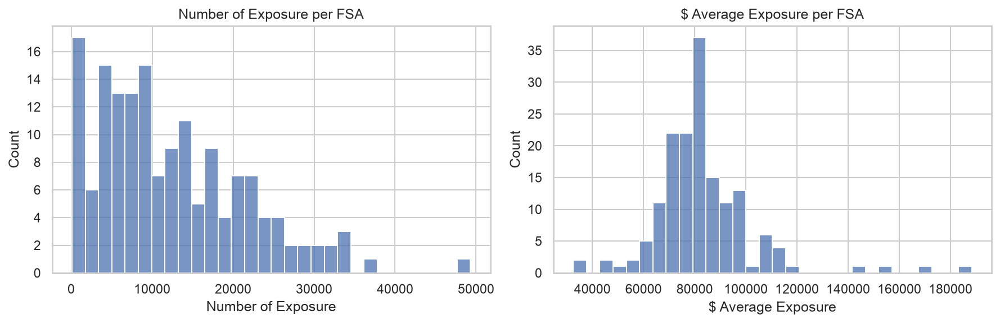

The portfolio (159 FSAs) is clean with no missing values; both exposure count and average exposure value are right-skewed, with a handful of FSAs carrying disproportionately large exposure.

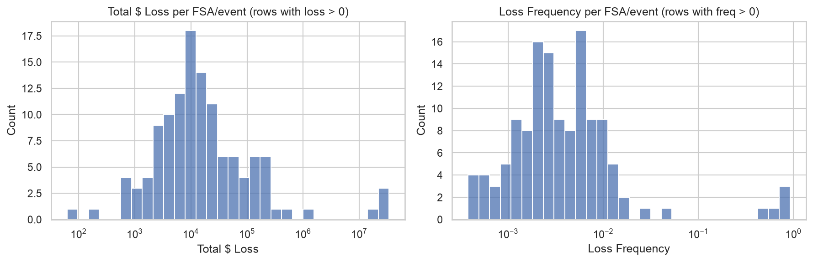

Most FSA/event rows in the claims data record **zero loss**; losses are concentrated in a minority of FSAs per event. Among the rows with a nonzero loss, `Total $ Loss` spans roughly six orders of magnitude ($62 to $33.9M), which required log-scale visualization to interpret at all.

The largest losses were checked against portfolio exposure before being trusted: loss-to-insured-value ratios of 1.5–14.7% and claim frequencies of 83–92% in the affected FSAs are consistent with a genuinely catastrophic, near-total-loss event rather than a data entry error.

Coverage between the two source tables is not perfectly aligned: several FSAs are missing entire rows (not zero-loss rows) from one or both events. This distinction matters for frequency modelling: "no row" and "confirmed zero" should not be treated identically.

#### Severity vs. exposure

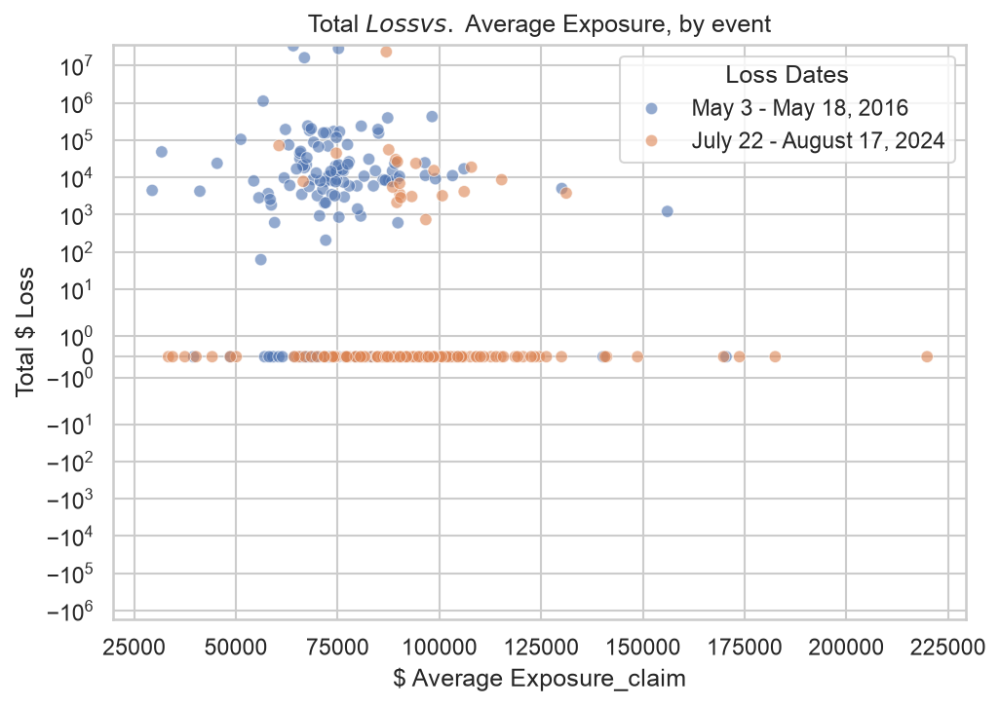

No clear linear relationship between an FSA's average exposure value and its total loss. Loss appears to be driven more by *whether* an FSA was affected at all than by exposure scaling smoothly with loss.

#### Fire weather vs. loss

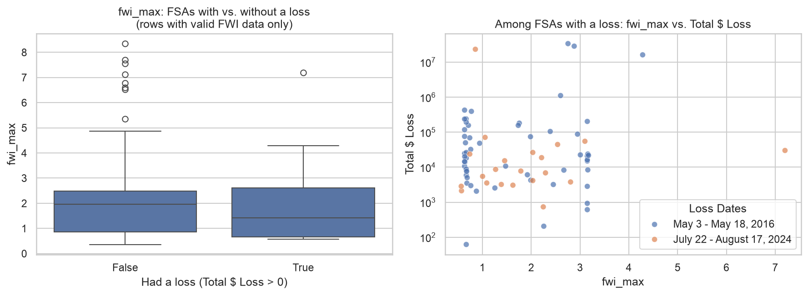
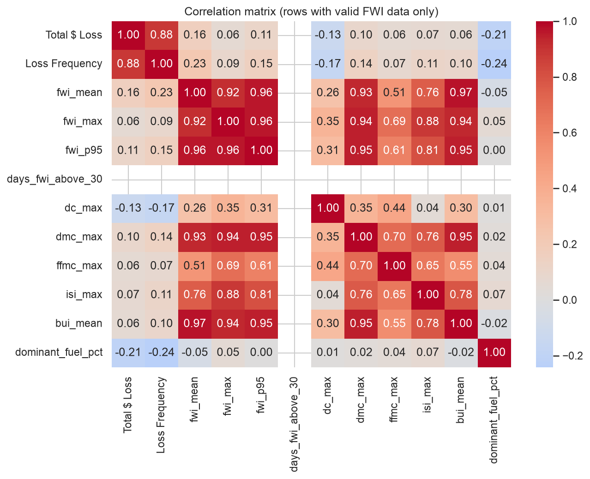

24% of claim rows (73 of 305) have no usable FWI signal for their event window. Investigation showed that most missing FWI values (72 of 73, all from the May 2016 event) occurred because the WF93 fire season had not yet begun in those FSAs during the event window; the remaining 1 is the `T3T` boundary gap. With only two events in the sample, correlations between FWI features and loss are exploratory signal at this stage, not yet a basis for model selection.

The correlation matrix covers all six FWI components. One feature, `days_fwi_above_30`, is blank throughout: FWI never exceeded 30 in either event window in this sample, so it has zero variance and an undefined correlation, and is not usable as a model feature in its current form.

#### Spatial pattern

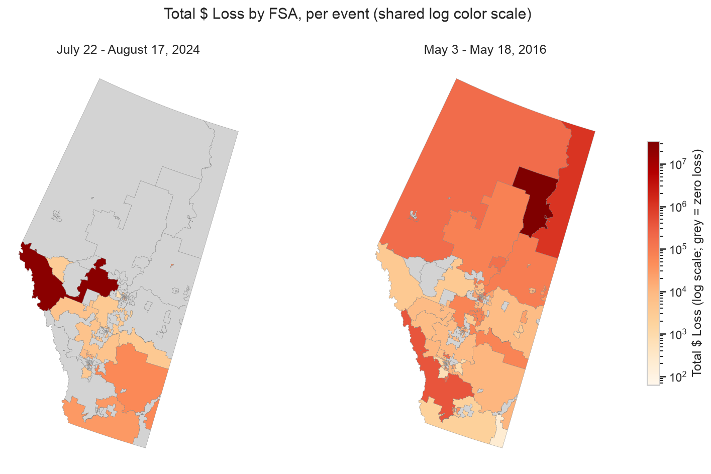

The two events show markedly different spatial signatures. The May 2016 event's worst-affected FSAs are meaningfully clustered geographically (including a contiguous trio of adjacent FSAs), consistent with a single wildfire spreading through a connected area. The July–August 2024 event's worst-affected FSAs are far more scattered, consistent with multiple smaller or disconnected fire locations rather than one dominant burn. A single "event-level shock" spatial-dependence structure may therefore fit one event better than the other.

#### Feature distributions

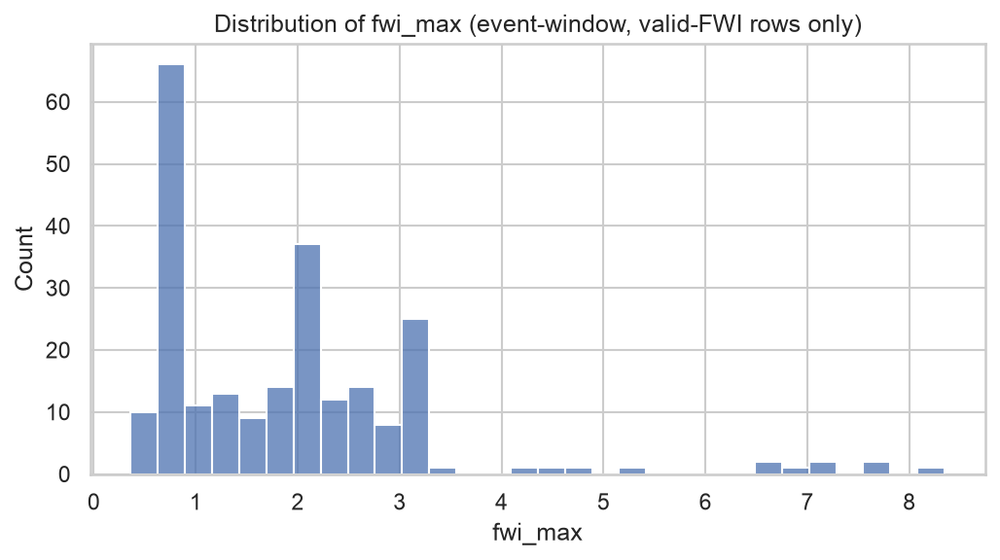
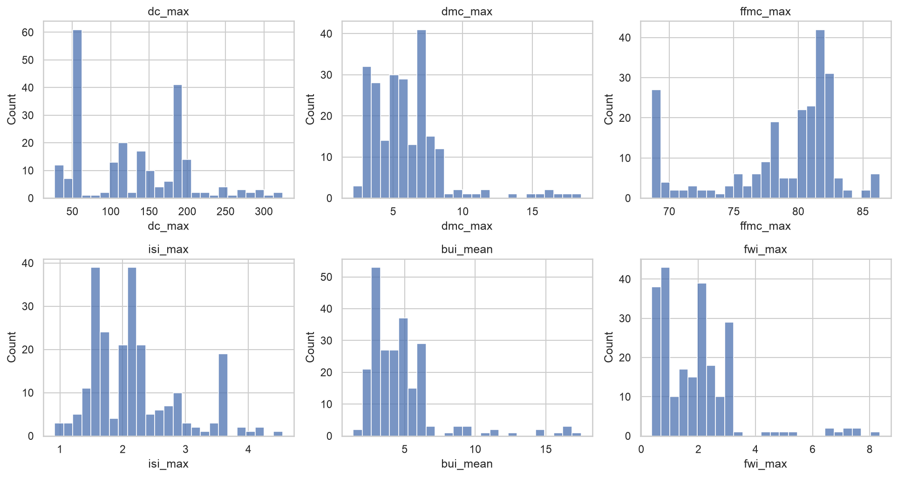

The distributions of `fwi_max` and the other five FWI components (DC, DMC, FFMC, ISI, BUI) are multi-modal rather than smoothly unimodal, consistent with the two events drawing from different fire-weather regimes rather than a single underlying distribution. Worth keeping in mind when choosing a distributional family for any FWI-based model feature.

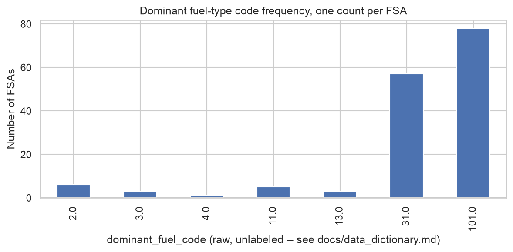

Two dominant fuel codes (`101` and `31`, unlabelled; see Section 2.3) account for the majority of Alberta FSAs, consistent with the province's real agricultural/forested split and with the fuel-raster validation performed during pipeline development.

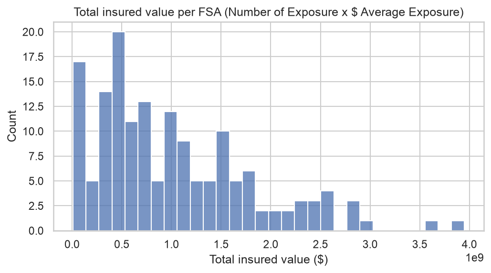

Total insured value per FSA (`Number of Exposure × $ Average Exposure`) is right-skewed, as expected given the individually right-skewed exposure count and average-exposure-value distributions above.

### 3.2 Feature selection

**Modelling set.** 73 rows with no valid FWI signal were excluded (1.1% of total loss) rather than imputed, leaving 232 rows. Claim counts were reconstructed as `round(Loss Frequency × Exposure)`. Verified against the source data that the small fractional remainder is rounding noise from `Loss Frequency`'s 5-decimal storage, not real fractional claims.

**Feature choice.** The EDA correlation matrix showed the FWI-family features are almost collinear with each other (r > 0.9). Using three low-collinearity predictors instead: two climate (`fwi_max`, headline fire-weather hazard; `dc_max`, drought/fuel-dryness proxy, r ≈ 0.35 with `fwi_max`) and one **geospatial** attribute (`dominant_fuel_pct`, r < 0.1 with both climate features), combining climate and geospatial information rather than climate alone.

Trying to use several FWI-family features together ran into severe multicollinearity (they're almost collinear with each other; see Section 3.1), forcing a reduction to two low-collinearity climate predictors. Since the assignment asks for both climate and geospatial features, one non-climate geospatial predictor (`dominant_fuel_pct`) was added on top.

### 3.3 Data limitations

- **Only 2 historical events** in the provided sample, a thin basis for frequency/severity estimation, and especially for tail risk. Model complexity should be scoped accordingly.
- **24% of claim rows lack FWI signal** and need an explicit handling decision (exclude, impute, or treat as a distinct pre-season/non-fire-weather category) before model fitting.
- **2 real FSAs (`T3T`, `T4K`) have no boundary/climate/fuel data** due to a boundary-file gap, not resolved yet.
- **Fuel-type codes are unlabelled** pending the official legend. Usable as categorical identifiers only, not as interpretable fuel classes, until sourced.
- **SSP1-2.6 is a single climate scenario**; results are conditional on that pathway.
- **FSA-level aggregation** of 30m fuel and gridded climate data necessarily loses within-FSA heterogeneity.
- **Portfolio/claims coverage gaps** (rows missing entirely vs. recorded zero) need consistent treatment in the frequency model.
- **`days_fwi_above_30` has zero variance** in this sample (FWI never exceeded 30). Not usable as a model feature without a different threshold or more data.

## 4. Model fitting and validation

A simple, deliberately scoped-down frequency-severity model was fit given the two-event data reality: standard GLMs on the 305-row claims feature table. Full detail: [`../notebooks/02_model_fitting.ipynb`](../notebooks/02_model_fitting.ipynb).

### 4.1 Model development

The objective throughout was not to maximize predictive accuracy, but to develop the simplest statistically defensible baseline consistent with the available data. The final model wasn't the first thing tried; each step below was a response to something the data forced:

Poisson was the natural starting frequency model, but proved badly overdispersed, forcing a switch to Negative Binomial. Only once the model itself was settled did validation (Section 4.4) and spatial dependence (Section 4.5) get layered on, followed by the future-climate projection (Section 5.4) as the last step, applying the finished model unchanged.

### 4.2 Frequency model

A Poisson GLM (claim count, offset by log-exposure) showed severe overdispersion (Pearson χ²/df ≈ 1,138). A Negative Binomial fit substantially better and is the frequency model going forward:

| Model | AIC |
|---|---|
| Poisson | 135,998.1 |
| Negative Binomial | 1,196.8 |

Whether `dominant_fuel_pct` earns its place is judged by whether it **improves the model**, not by its own p-value. With 232 rows and only 2 underlying events, any single coefficient's p-value is easy to over-read. Comparing the full model against a climate-only (`fwi_max`, `dc_max`) reduced model: adding `dominant_fuel_pct` improves AIC by 21.0 (1,217.8 → 1,196.8) and a likelihood ratio test rejects the reduced model strongly (LR = 23.0, df = 1, p = 1.65 × 10⁻⁶). `fwi_max`'s own p-value also drops once fuel is included (0.18), a concrete illustration of why the geospatial attribute matters, not just climate.

### 4.3 Severity model

Fitting a Gamma GLM on per-claim severity surfaced a real data issue: 3 FSAs have claims filed but exactly $0 total loss, which breaks the Gamma likelihood (it requires strictly positive values, and the initial fit returned an infinite log-likelihood). Fixed by excluding those 3 rows from the severity fit specifically; they remain correctly included in the frequency model, which only needs claim counts. On the remaining 76 rows, no predictor is statistically significant, reflecting the limited power of a 76-row severity sample.

### 4.4 Leave-one-event-out validation

With only 2 events, a conventional random train/test split would just re-split within one event's conditions rather than testing genuine generalization. **Leave-one-event-out** is the natural holdout instead: fit on one event's rows, evaluate on the other's, in both directions.

**Both directions failed to converge cleanly** (Negative Binomial MLE could not fit stably on a single event's 80–152 rows). This is a finding in its own right, not just noisy output: it demonstrates the "only 2 events" limitation mechanically, not just in the abstract. The point estimates, read as illustrative only:
- **Trained on May 2016, tested on Jul/Aug 2024**: predicted total loss $186K vs. actual $23.7M, near-total under-prediction, rank correlation ≈ 0 (0.068).
- **Trained on Jul/Aug 2024, tested on May 2016**: predicted total loss $189.9M vs. actual $83.2M, overshoots by ~2.3×, weak positive rank correlation (0.297).

### 4.5 Spatial-dependence sensitivity analysis

A single wildfire (or shared weather conditions) can plausibly drive correlated losses across multiple FSAs in the same event, rather than each FSA's outcome being independent. The GLMs above assume independence. Approach: **Generalized Estimating Equations (GEE)** with an exchangeable correlation structure, grouped by event. GEE provides a simple framework for representing within-event correlation, although with only two wildfire events both the estimated correlation and its uncertainty should be interpreted with considerable caution. This is a deliberately simple, defensible choice given the data, not the fully identified event-random-effect/copula structure originally considered (which does need more than 2 events).

**The available data contain insufficient independent wildfire events to estimate within-event correlation reliably.** With only 2 clusters, the standard "many clusters" asymptotics GEE relies on do not hold, so the correlation parameter itself is not a precise estimate of anything. The raw number (-0.008, essentially zero) should **not** be read as evidence that there is no event-level spatial dependence. It should be read as: this data cannot answer that question with any real precision, in either direction. That is a stronger, more scientifically honest statement than "no dependence detected," and it is the one this report makes.

What the fit *can* say something about is the standard errors: GEE's cluster-robust SEs are larger than the naive model's for `fwi_max` and `dominant_fuel_pct`, but *smaller* for `dc_max`, a mixed pattern showing that naively assuming independence does not uniformly overstate confidence here. With only 2 clusters, cluster-robust inference is a known-difficult regime; this is a reasonable, honestly-caveated attempt at the requirement, not a settled answer about whether spatial dependence exists.

## 5. Results and insights

### 5.1 Model comparison and coefficients

**Coefficient table and plot.**

| Model | Term | Coef | Std err | p-value | Significant (p<0.05) |
|---|---|---|---|---|---|
| Frequency (NB) | const | −0.537 | 0.744 | 0.470 | No |
| Frequency (NB) | fwi_max | 0.239 | 0.178 | 0.181 | No |
| Frequency (NB) | dc_max | −0.025 | 0.003 | <0.001 | Yes |
| Frequency (NB) | dominant_fuel_pct | −4.458 | 0.908 | <0.001 | Yes |
| Frequency (NB) | alpha (dispersion) | 10.502 | 1.371 | <0.001 | Yes |
| Severity (Gamma) | const | 7.843 | 0.679 | <0.001 | Yes |
| Severity (Gamma) | fwi_max | 0.030 | 0.165 | 0.854 | No |
| Severity (Gamma) | dc_max | 0.003 | 0.003 | 0.452 | No |
| Severity (Gamma) | dominant_fuel_pct | −1.455 | 0.833 | 0.081 | No |

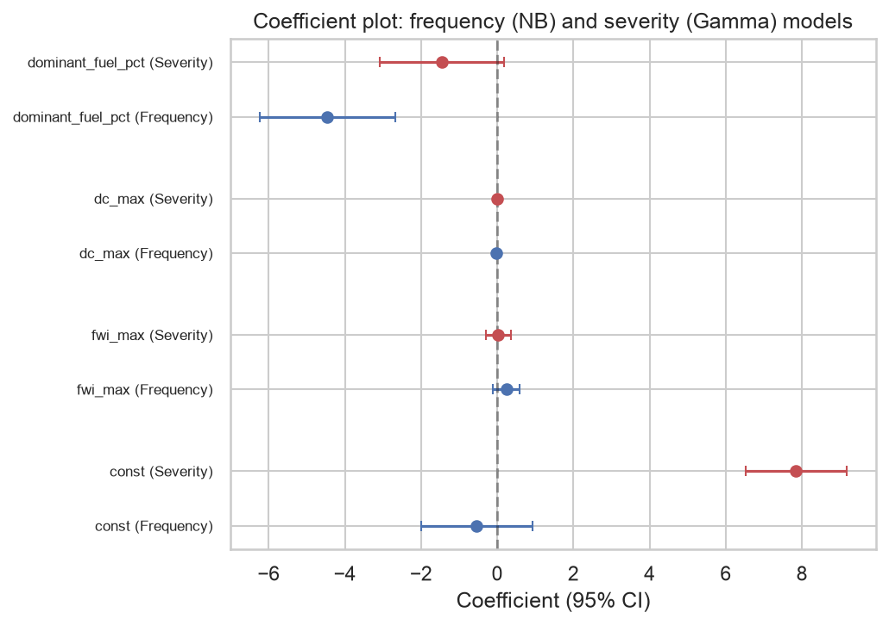

### 5.2 In-sample performance

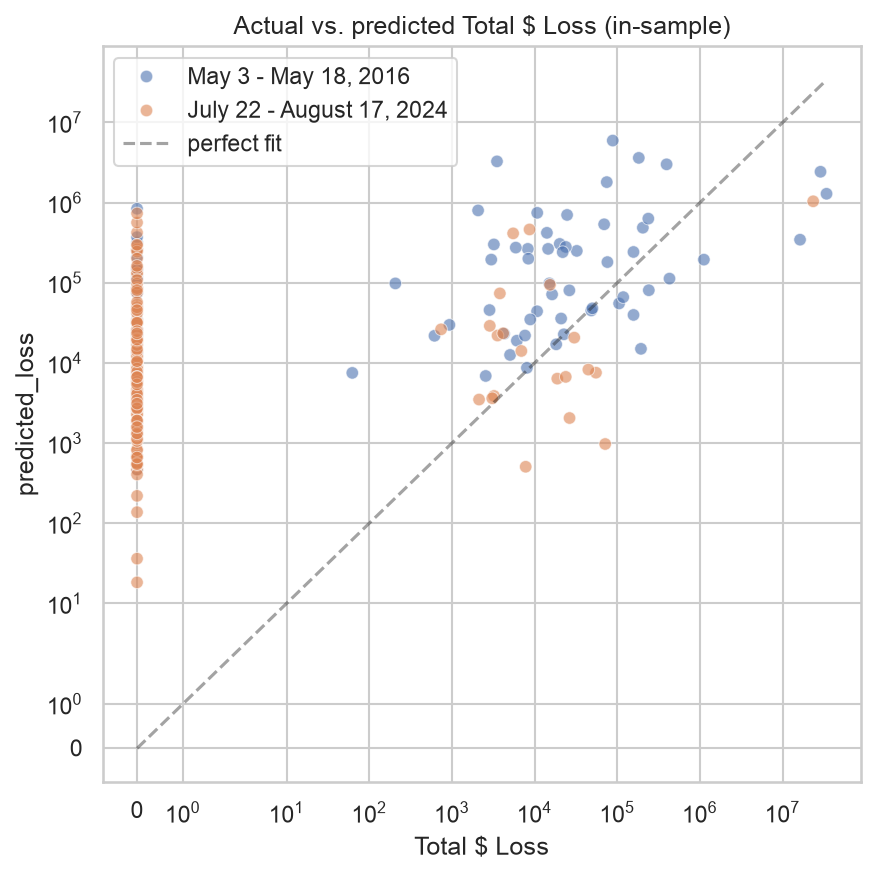

**Combined in-sample check.** Predicted total loss on the modelling set is $41.4M against an actual $106.9M (39%), a plausible order of magnitude, but the scatter plot shows weak row-level discrimination: FSAs with true zero loss receive predicted values spread across several orders of magnitude, and the largest actual losses are substantially under-predicted. This is the expected result of a genuinely simple three-predictor baseline on 232 rows, not a finished model.

| Metric | Value |
|---|---|
| MAE | $572,725 |
| RMSE | $3,336,833 |
| Mean residual (actual − predicted) | $282,545 |

RMSE nearly 6× MAE confirms a small number of large-loss rows dominate the error, and a positive mean residual confirms a systematic tendency to under-predict, not just a few large outliers pulling RMSE up in either direction. The totals also do not fit equally well by event: the pooled 39% figure hides a 32.5% predicted-of-observed ratio for July/August 2024 vs. 40.5% for May 2016.

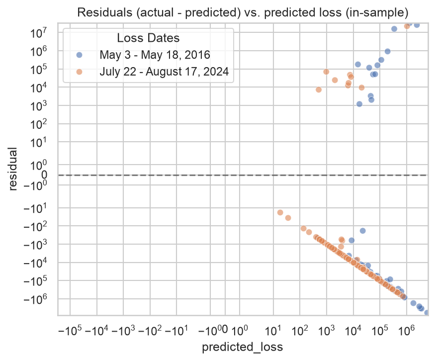

The residual plot (actual − predicted) confirms the same story from a different angle: rather than a random band around zero, residual magnitude grows with predicted loss and the largest actual losses are systematically under-predicted (large positive residuals at the high end). This is remaining heteroscedasticity consistent with a simple three-predictor baseline, not evidence of a coding error.

### 5.3 Out-of-sample findings

**Conclusion: the available data do not permit stable estimation of this model under leave-one-event-out validation.** That is a statement about the data (2 events is too few to hold one out and still fit reliably), not a verdict that the modelling approach itself is wrong. A Negative Binomial/Gamma frequency-severity structure is a standard, defensible choice, and there is no evidence here that a different model family would fare better on the same 2 events. This is still an honest, important validation result worth reporting as-is: it empirically demonstrates, rather than just argues, that more events are needed before this model's out-of-sample performance can be trusted.

### 5.4 Illustrative future climate projection

Historical → future → apply the same fitted model → compare. Future climate variables were processed using the same aggregation pipeline as the historical data to ensure methodological consistency, then combined with the same geospatial feature the model was fit on (`dominant_fuel_pct`). The already-fitted frequency and severity models (Section 4) were applied as-is, with **no refitting**.

**This is the weakest-founded output in this report, and the numbers below are labelled accordingly.** The model was trained on `fwi_max`/`dc_max` defined as the maximum/mean *within a specific claim's event-date window* (days to weeks). Both columns below instead use the *mean over the entire multi-year period*. There is no natural full-period equivalent of an event window, and this affects the historical comparison column too, not just the future one. Applying a model fit on event-window extremes to period-average inputs pushes it outside the distribution it was trained on, so these outputs are less trustworthy than anything in Sections 4–5.3, which all use the model's native event-window feature definition. For that reason the rows below are labelled **"illustrative,"** not "expected" or "predicted":

| Metric | Historical baseline (2015–2025) | Illustrative SSP1-2.6 scenario (2045–2050) | Relative difference |
|---|---|---|---|
| Mean FWI | 3.47 | 1.36 | −61% |
| Mean DC | 203.6 | 148.7 | −27% |
| Illustrative claim frequency (portfolio total) | 1,870 | 3,862 | +107% |
| Illustrative projected loss (portfolio total) | $4.5M | $7.65M | +70% |

No prediction interval is reported alongside these numbers: parameter uncertainty is substantial and only two historical events were available, so any interval computed from this model would itself be highly unstable. Reporting one without saying so would overstate the precision of these figures.

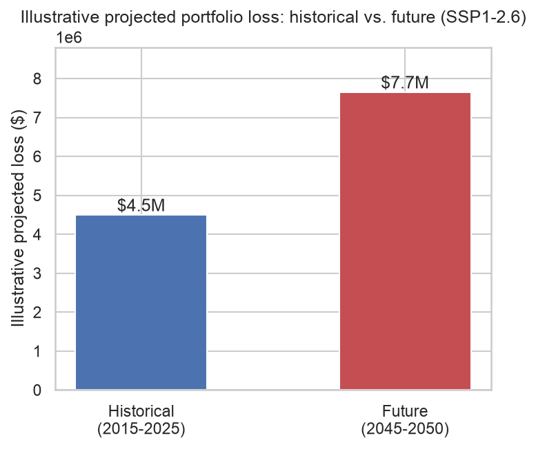

The portfolio total masks where the change happens. Three panels: historical and future illustrative projected loss, and % change per FSA on a diverging color scale (blue = decrease, red = increase, centered at zero). Percentile colouring was used because projected losses are highly skewed, making absolute colour scales difficult to interpret:

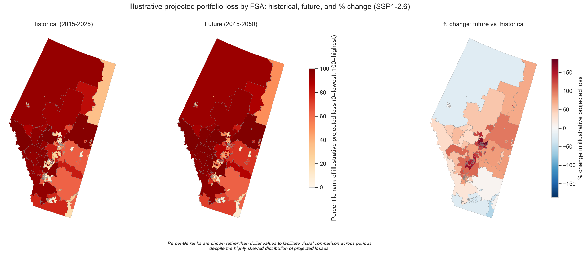

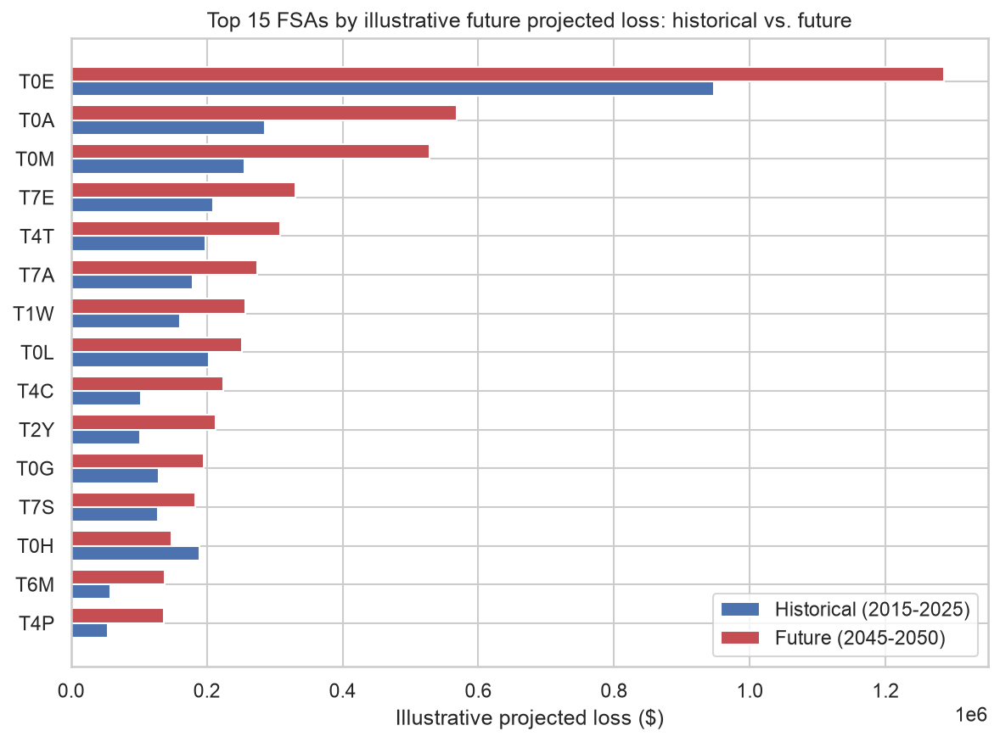

**Two findings here, neither should be taken at face value.**

*Mean FWI drops ~61%, mean DC drops ~27%.* Checked this isn't a bug: every one of the 6 future years is lower than nearly every historical year, and missing-data rates are similar between periods (55.5% vs. 53.1%). It's a real, consistent signal from this specific climate run. But it is a **single model, single scenario, single ensemble member**. Other CMIP6 models frequently project *increasing* fire weather risk for similar regions under similar scenarios. This should not be read as "Alberta wildfire risk is decreasing"; it is what this one model run says, and a genuine risk assessment needs a multi-model ensemble to say more than that.

*Illustrative claim frequency and illustrative projected loss both rise despite FWI falling.* Not a bug either: the fitted frequency model has a *negative* `dc_max` coefficient (lower drought code → higher predicted frequency), so the drop in `dc_max` pushes the illustrative frequency, and therefore loss, up more than the drop in `fwi_max` pushes it down. That coefficient was learned from only 2 historical events with very different characteristics and is plausibly an artifact of which event happened to have the lower `dc_max`, not a stable physical relationship. Applying it to a new climate regime, on top of the event-window-vs-period-average scale mismatch noted above, and getting a counterintuitive result is a concrete demonstration of Section 5.3's finding that this model's out-of-sample performance cannot be trusted with only 2 events. **These numbers illustrate the methodology, not a trustworthy forecast of actual future losses.**

### 5.5 Business interpretation

Although the baseline model under-predicts large individual losses, it provides a transparent framework for integrating climate, geospatial, and exposure information. In its current form it is better suited to exploratory climate-risk analysis than operational pricing or capital allocation. With additional historical wildfire events, the same framework could be extended into a production-quality risk model.

The project demonstrates that climate and geospatial data can be integrated into a reproducible insurance modelling workflow. While the available data are insufficient for reliable predictive deployment, they are sufficient to establish a transparent modelling framework that can be extended as additional historical wildfire events become available.

## 6. Limitations

**A modelling choice worth flagging as a limitation, not resolving here:** the severity model reuses the exact same three predictors as the frequency model, purely for simplicity. That's not obviously correct. Frequency plausibly depends on weather conditions (is a fire likely to start/spread), while severity plausibly depends more on exposure characteristics (what's actually at risk once a fire happens). No predictor being significant in the severity fit is at least consistent with weather not being the right driver of severity specifically, though with only 76 rows that's weak evidence either way. A different, exposure-oriented predictor set for severity is worth trying with more data.

**Caveat.** Future projections were generated by applying the fitted historical model to mean climate features derived from the future SSP1-2.6 scenario, computed on a different feature scale (period-average, not event-window) than the model was trained on. This assumes that the statistical relationship between climate variables and insured losses remains unchanged over time and does not account for changes in exposure, mitigation, or wildfire management practices.

## 7. Recommended next steps

Ordered by business value:

1. **More historical wildfire events.** The single highest-value addition. Nearly every limitation in this report (non-convergent validation, imprecise spatial-dependence estimate, a projection driven by likely-spurious coefficients) traces back to having only 2 events.
2. **Monte Carlo portfolio simulation.** Once enough events exist to identify a proper event-random-effect or copula structure, use it to simulate the portfolio loss distribution and produce real prediction intervals, not reported here (Section 5.4).
3. **Multi-model climate ensemble.** Widen the future projection beyond one model/scenario/member for a real uncertainty range, and resolve the event-window-vs-period-average feature scale mismatch (Section 5.4) before treating any future comparison as more than illustrative.
4. **Resolve remaining data gaps.** The FWI-coverage decision, the `T3T`/`T4K` boundary gap, and the official fuel-type code legend all need resolving before feature finalization.
5. **Alternative severity predictors.** Reconsider whether severity should share the frequency model's climate predictors (Section 4.3), or whether an exposure-oriented predictor set fits better.

---

## Appendix A: Abbreviations

| Abbreviation | Definition |
|---|---|
| AIC | Akaike Information Criterion |
| BUI | Buildup Index (FWI component) |
| CMIP6 | Coupled Model Intercomparison Project Phase 6 |
| DC | Drought Code (FWI component) |
| DMC | Duff Moisture Code (FWI component) |
| EDA | Exploratory Data Analysis |
| FBP | Fire Behavior Prediction (Canadian fuel-type classification system) |
| FFMC | Fine Fuel Moisture Code (FWI component) |
| FSA | Forward Sortation Area |
| FWI | Fire Weather Index |
| GEE | Generalized Estimating Equations |
| GLM | Generalized Linear Model |
| ISI | Initial Spread Index (FWI component) |
| LOEO | Leave-one-event-out |
| LR | Likelihood ratio |
| MAE | Mean Absolute Error |
| MLE | Maximum Likelihood Estimation |
| NB | Negative Binomial |
| NEX-GDDP-CMIP6 | NASA Earth Exchange Global Daily Downscaled Projections (CMIP6) |
| RMSE | Root Mean Square Error |
| SE | Standard error |
| SSP1-2.6 | Shared Socioeconomic Pathway 1-2.6 (climate scenario) |
| StatCan | Statistics Canada |
| WF93 | Van Wagner (1993) fire-season start model |
